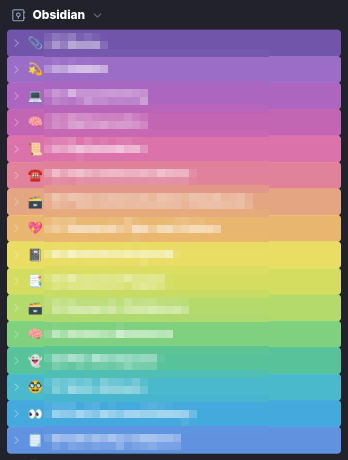
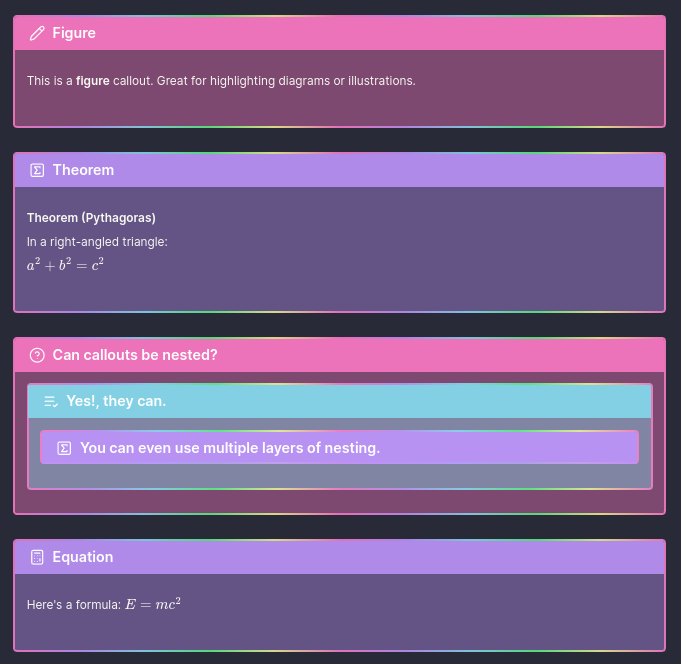
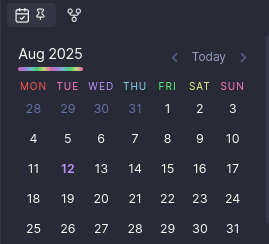
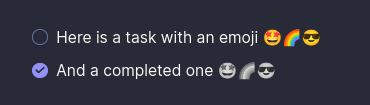

# 🌈 Obsidian CSS Snippets Collection

> **A curated set of beautiful, functional CSS snippets to supercharge your Obsidian vault.**

Welcome to the **Obsidian CSS Snippets Collection**! This repository contains a variety of CSS snippets designed to enhance the look and feel of your Obsidian notes. Each snippet is modular, use them individually or combine for a unique, colorful, and highly readable workspace.

---

## ✨ Snippet Overview

| File | Description |
|------|-------------|
| [`calendar-heading.css`](./calendar-heading.css) | Colors each day of the week in the calendar plugin for quick visual reference. |
| [`callouts.css`](./callouts.css) | Adds gradient borders and semi-transparent backgrounds to callouts for a modern, vibrant look. |
| [`codeblock.css`](./codeblock.css) | Adds a solid left border to code blocks for better distinction. |
| [`colorful-headings.css`](./colorful-headings.css) | Styles all headings with a repeating rainbow gradient for both edit and preview modes. |
| [`coloured-folders.css`](./coloured-folders.css) | Assigns rainbow colors to folders in the navigation pane based on their prefix, improving organization. |
| [`external-links.css`](./external-links.css) | Applies a gradient effect to all links and custom icons for external links. |
| [`faded-task-emoji.css`](./faded-task-emoji.css) | Fades out emoji in checked task list items for a subtle, completed look. |
| [`folder-callout.css`](./folder-callout.css) | Styles folder callouts for collapsible, readable folder/file lists in notes. |
| [`footnotes.css`](./footnotes.css) | Enhances footnote references and text for clarity and visibility. |
| [`image-settings.css`](./image-settings.css) | Centers images and sets a max width for a cleaner appearance. |
| [`larger-latex.css`](./larger-latex.css) | Increases the font size of LaTeX math for better readability. |
| [`root-colors.css`](./root-colors.css) | Defines the Dracula theme color palette used by other snippets. |

---

## 🎨 Snippet Details

### `calendar-heading.css`

Colors the calendar plugin's weekday headings using Dracula theme colors. Each day gets a unique color, making it easy to spot weekends and patterns at a glance.

### `callouts.css`

Modernizes callouts with a soft background tint and a vibrant, multi-colour gradient border. Great for making important notes or warnings stand out.

### `codeblock.css`

Adds a solid left border to code blocks in both preview and source modes, making code snippets pop out from regular text.

### `colorful-headings.css`

Applies a repeating rainbow gradient to all headings (H1-H6) in both edit and preview modes. Headings become visually distinct and add flair to your notes.

### `coloured-folders.css`

Assigns a unique colour to each folder in the navigation pane based on its prefix. This helps visually organise your vault and quickly locate folders.

### `external-links.css`

Styles all internal and external links with a gradient effect. External links also get custom icons, making it easy to distinguish them from internal links.

### `faded-task-emoji.css`

When a task is checked off, any emoji in the task fades out, providing a subtle visual cue for completed items.

### `folder-callout.css`

Styles callouts with the `folder` type to display collapsible, indented folder/file lists perfect for showing folder structures in notes.

### `footnotes.css`

Improves the appearance of footnote references and text, making them more readable and visually distinct from regular text.

### `image-settings.css`

Centers images in both preview and source modes, and ensures images inside links are also centered. Sets a max width for images to keep notes tidy.

### `larger-latex.css`

Increases the font size of LaTeX math blocks, making mathematical expressions easier to read.

### `root-colors.css`

Defines the Dracula theme color palette as CSS variables. All other snippets use these variables for consistent theming.

---

## 🚀 Getting Started

1. **Download** or **clone** this repository.
2. Copy any `.css` snippet(s) you want into your Obsidian vault's `.obsidian/snippets/` folder.
3. Enable the snippet(s) in Obsidian via `Settings → Appearance → CSS Snippets`.
4. Enjoy your beautifully styled notes!

---

## 🖌️ Customization

- All snippets are modular mix and match as you like.
- Tweak colour variables in `root-colors.css` to match your own theme.
- Edit folder prefixes in `coloured-folders.css` to fit your vault structure.

---

## 📸 Previews

### Coloured Folders

### Custom Callouts

### Calendar

### Faded Task Emoji

---

## 📝 License

MIT License. Feel free to use, modify, and share!

---

## 💡 Credits

- Inspired by the [Dracula Theme](https://draculatheme.com/)
- Created by [breezy-codes](https://github.com/breezy-codes)

---

Happy Notetaking! 🌟
